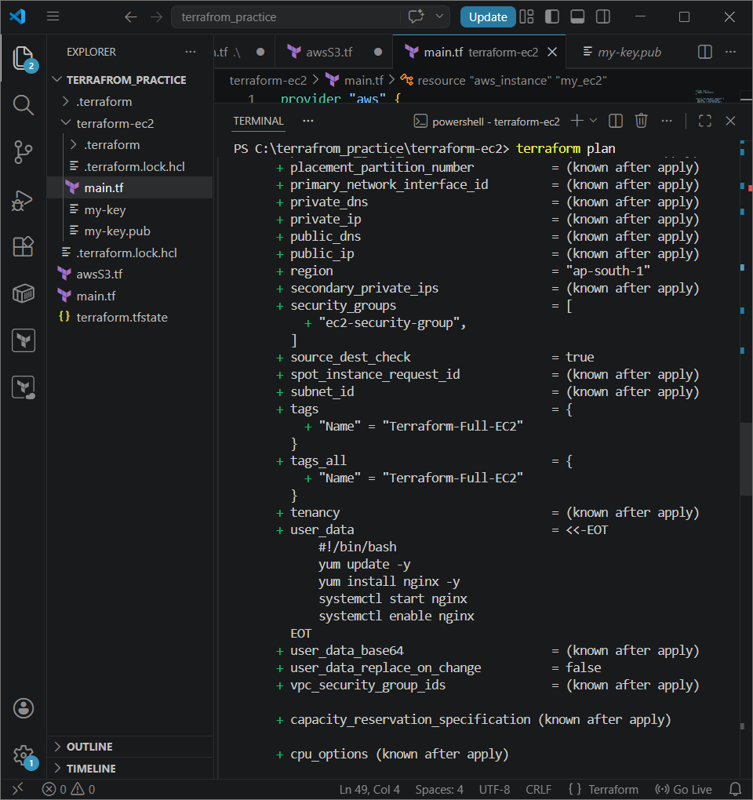
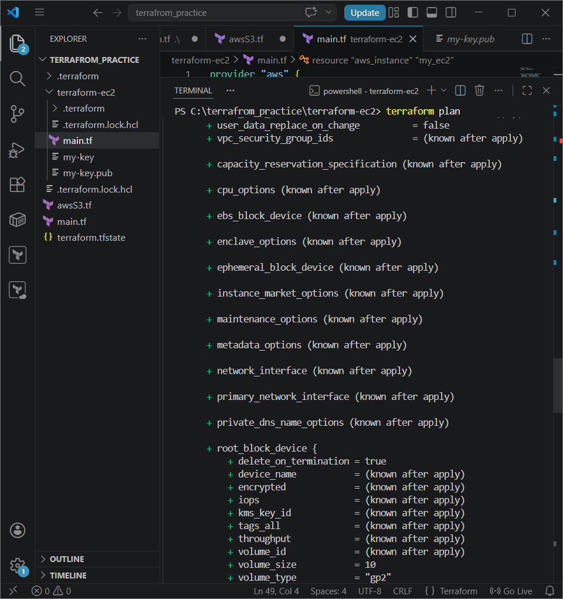
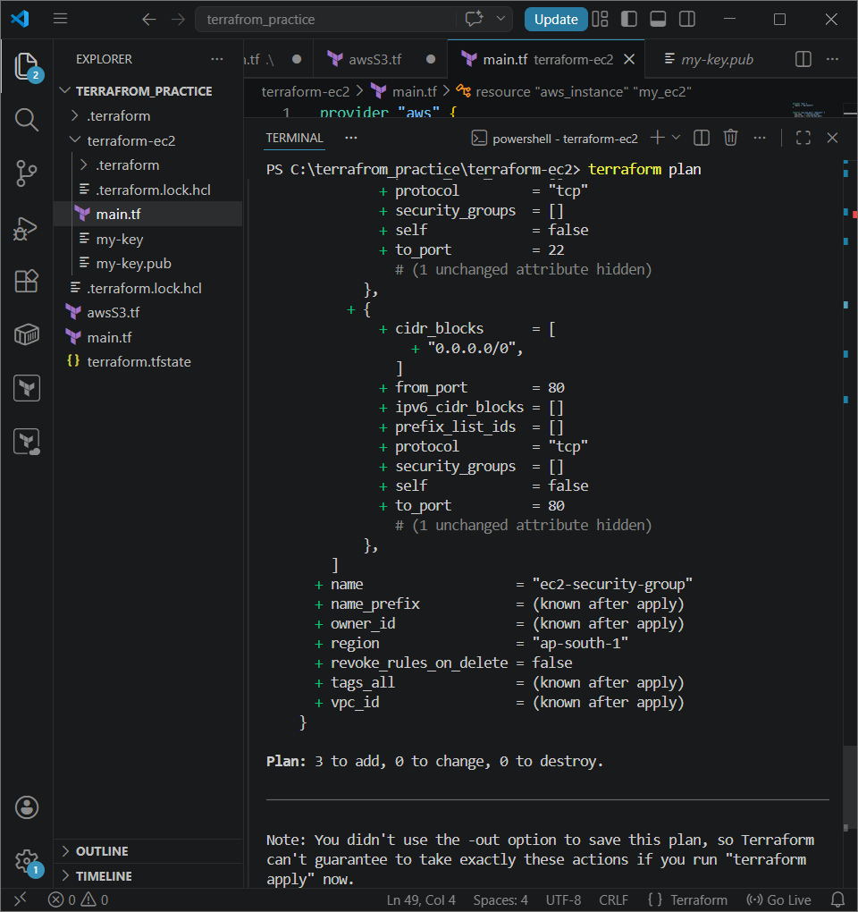
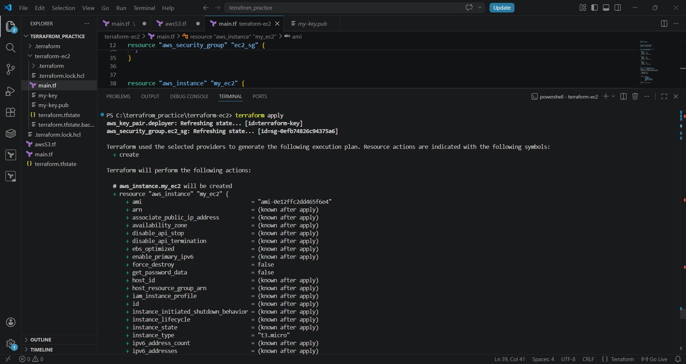
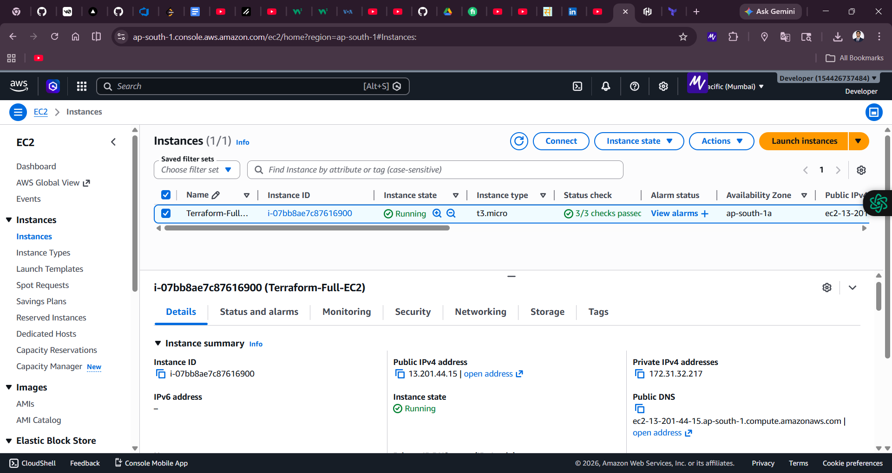
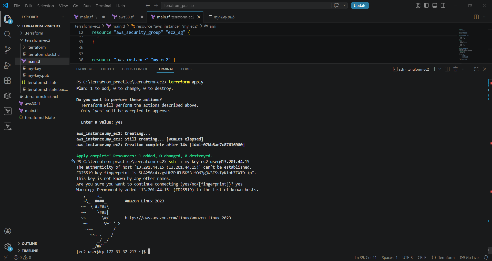
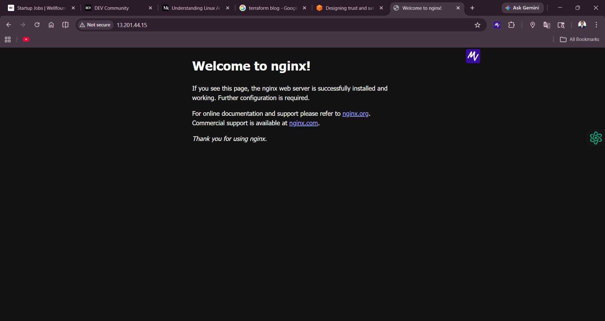

# Terraform AWS EC2 

This project demonstrates how to provision a fully configured AWS EC2 instance using Terraform.

---

## Project Overview

This setup includes:

- EC2 Instance (t3.micro)
- Security Group (SSH & HTTP access)
- Key Pair (SSH login)
- EBS Storage (10GB)
- Nginx Web Server (auto installed)

---

## Architecture

- AWS EC2
- Security Group (Port 22, 80)
- SSH Key Pair
- EBS Volume
- Nginx Server

---

##  Prerequisites

- AWS Account  
- AWS CLI configured (`aws configure`)  
- Terraform installed  
- Git installed  

---

## Terraform Code

```hcl
provider "aws" {
  region = "ap-south-1"
}

 
resource "aws_key_pair" "deployer" {
  key_name   = "terraform-key"
  public_key = file("my-key.pub")
}

 
resource "aws_security_group" "ec2_sg" {
  name = "ec2-security-group"

  ingress {
    from_port   = 22
    to_port     = 22
    protocol    = "tcp"
    cidr_blocks = ["0.0.0.0/0"]
  }

  ingress {
    from_port   = 80
    to_port     = 80
    protocol    = "tcp"
    cidr_blocks = ["0.0.0.0/0"]
  }

  egress {
    from_port   = 0
    to_port     = 0
    protocol    = "-1"
    cidr_blocks = ["0.0.0.0/0"]
  }
}

 
resource "aws_instance" "my_ec2" {
  ami           = "ami-0e12ffc2dd465f6e4"
  instance_type = "t3.micro"
  key_name      = aws_key_pair.deployer.key_name
  security_groups = [aws_security_group.ec2_sg.name]
 
   root_block_device {
    volume_size = 10
    volume_type = "gp2"
  }

   
  user_data = <<-EOF
              #!/bin/bash
              yum update -y
              yum install nginx -y
              systemctl start nginx
              systemctl enable nginx
              EOF

  tags = {
    Name = "Terraform-Full-EC2"
  }
}


 Deployment Steps
1. Initialize Terraform
terraform init
2. Check Plan
terraform plan
3. Apply Configuration
terraform apply

Type yes when prompted.

 Connect to EC2
ssh -i my-key ec2-user@<your-public-ip>
 Output

Open in browser:

http://<your-public-ip>

 Nginx page will be visible

 
 ### Terraform Plan





### Terraform Apply



### EC2 Instance


### Nginx Output




 Cleanup
terraform destroy

 Project Structure
terraform-ec2/
├── main.tf
├── .gitignore
├── screenshots/
│   ├── nginx_successful.png
│   ├── nginx_server.png
│   ├── terraform_apply.png
│   ├── terraform_ec2_instance.png
│   ├── terraform_ec2_plan.png
│   └── terraform1_apply.png
├── my-key.pub
├── README.md


 Security
Private key (my-key) is not uploaded
.gitignore protects sensitive files


 Learnings
Terraform basics
AWS EC2 provisioning
Security groups
Infrastructure as Code
Automation using user_data


 Author

Ayush Nath Motichur